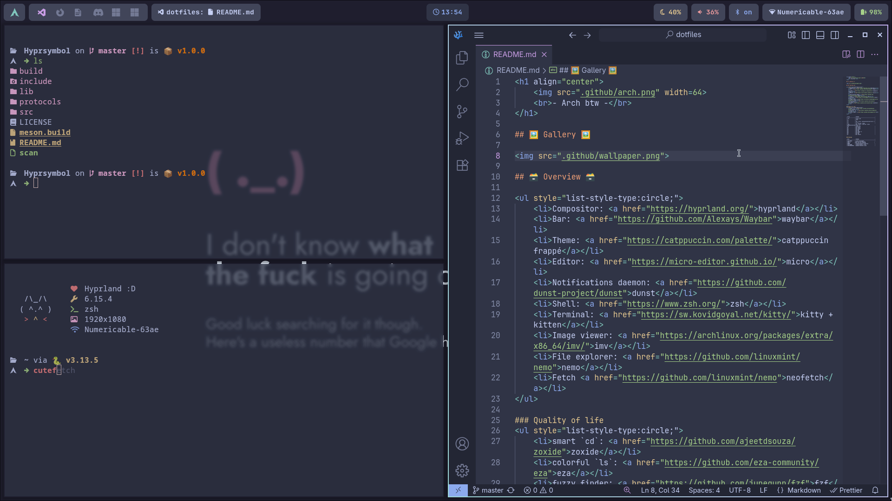

<h1 align="center">
    
    <br>- Arch btw -</br>
</h1>

## 🖼️ Gallery 🖼️




> [!TIP]
> If you want to save your configuration to github using
> the `update.sh` script, don't forget to install `rsync`!


## 🗃️ Overview 🗃️

<ul style="list-style-type:circle;">
    <li>Display Manager<a href="https://github.com/sddm/sddm/">sddm</a></li>
    <li>Compositor: <a href="https://hyprland.org/">hyprland</a></li>
    <li>Dmenu: Fuzzel</li>
    <li>Packet manager: <a href="https://github.com/Morganamilo/paru">paru</a></li>
    <li>Bar: <a href="https://github.com/Alexays/Waybar">waybar</a></li>
    <li>Theme: <a href="https://catppuccin.com/palette/">catppuccin frappe</a></li>
    <li>Editor: <a href="https://micro-editor.github.io/">micro</a></li>
    <li>Notifications daemon: <a href="https://github.com/dunst-project/dunst">dunst</a></li>
    <li>Shell: <a href="https://www.zsh.org/">zsh</a></li>
    <li>Terminal: <a href="https://sw.kovidgoyal.net/kitty/">kitty + kitten</a></li>
    <li>Image viewer: <a href="https://archlinux.org/packages/extra/x86_64/imv/">imv</a></li>
    <li>File explorer: <a href="https://github.com/linuxmint/nemo">nemo</a></li>
    <li>Fetch <a href="https://github.com/alphatechnolog/cutefetch">cutefetch</a></li>
</ul>

### Quality of life
<ul style="list-style-type:circle;">
    <li>smart `cd`: <a href="https://github.com/ajeetdsouza/zoxide">zoxide</a></li>
    <li>colorful `ls`: <a href="https://github.com/eza-community/eza">eza</a></li>
    <li>fuzzy finder: <a href="https://github.com/junegunn/fzf">fzf</a></li>
</ul>


| Alias           | Command                                  |
|-----------------|------------------------------------------|
| icat            | kitten icat                              |
| c               | clear                                    |
| cd              | z                                        |
| ls              | eza --icons --group-directories-first -1 |
| la              | ls -a                                    |
| ll              | la --no-user --long                      |
| tree            | eza --icons --tree eza --icons --group-directories-first -1 |
| ssh             | kitten ssh                               |
| gb              | git branch                               |
| gs              | git status                               |
| gw              | git switch                               |
| gd              | git diff                                 |
| ga              | git add                                  |
| gm              | git commit -m                            |
| gp              | git push                                 |
| gl              | git log                                  |
| gr              | git restore                              |


### Bindings

| Bind            | Command                                  |
|-----------------|------------------------------------------|
| CTRL+SPACE      | accept autosuggets                       |
| CTRL+->         | move one word forwards                   |
| CTRL+<-         | move one word backwards                  |
| SUPPR           | forward deletes a character              |
| CTRL+SUPPR      | forward deletes a word                   |
| CTRL+BACKSPACE  | backward deletes a word                  |

## Installation (Arch)
First, run `packages.sh` to download the packages.

### Shell
Change your default shell by ZSH with
```sh
chsh -s /usr/bin/zsh
```
> [!WARNING]
> This **must not** be run in sudo!
> You will change the shell of root otherwise.

### Cursors
Download the [Nordzy Cursors](https://github.com/guillaumeboehm/Nordzy-cursors) and 

### Sddm
Replace your `/etc/sddm.conf` with the one in `src/`

### Fixing
There's high chance that everything didn't went as planned.
In such case, some packages may help you fix your installation.

#### [wev](https://github.com/jwrdegoede/wev)
Wev helps you finding a key-code. You can then change the wanted key in your configuration(s).

TODO: insert image
