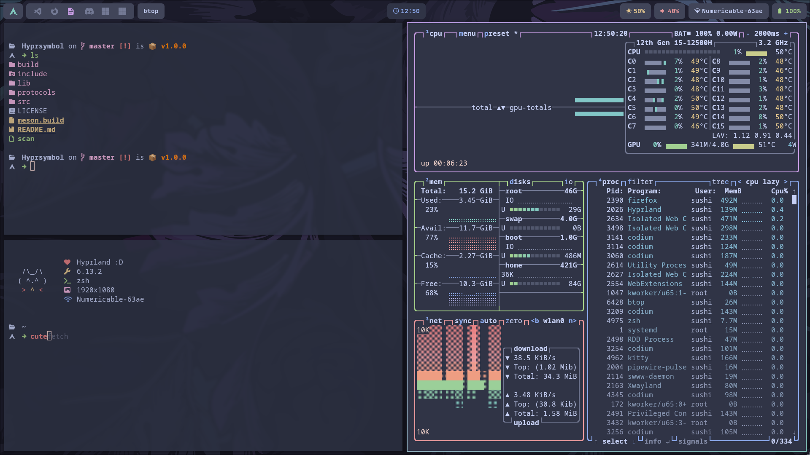

<h1 align="center">
    
     - Arch btw - 
</h1>

## 🖼️ Gallery 🖼️

## 🗃️ Overview 🗃️

<ul style="list-style-type:circle;">
    <li>Compositor: <a href="https://hyprland.org/">hyprland</a></li>
    <li>Bar: <a href="https://github.com/Alexays/Waybar">waybar</a></li>
    <li>Theme: <a href="https://catppuccin.com/palette/">catppuccin frappé</a></li>
    <li>Editor: <a href="https://micro-editor.github.io/">micro</a></li>
    <li>Notifications daemon: <a href="https://github.com/dunst-project/dunst">dunst</a></li>
    <li>Terminal: <a href="https://sw.kovidgoyal.net/kitty/">kitty + kitten</a></li>
    <li>Image viewer: <a href="https://archlinux.org/packages/extra/x86_64/imv/">imv</a></li>
</ul>
